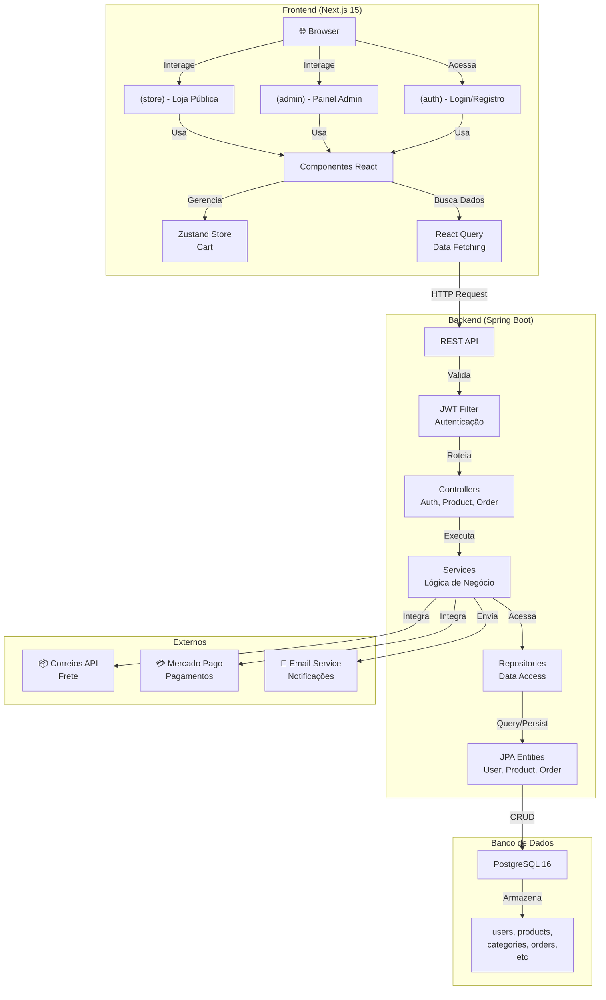
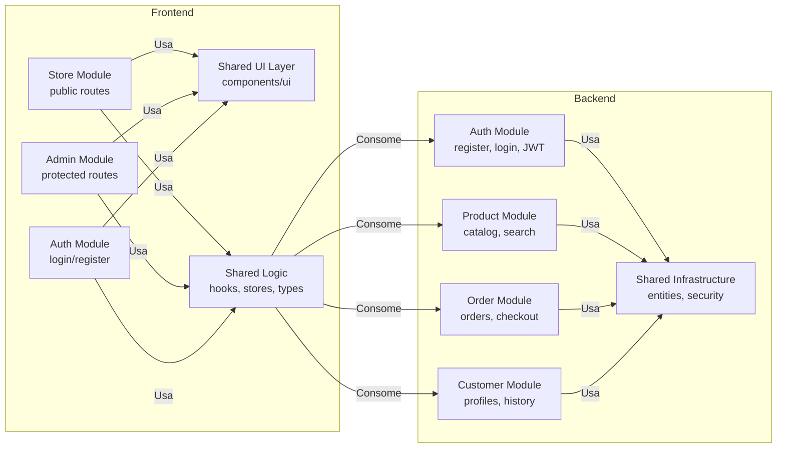
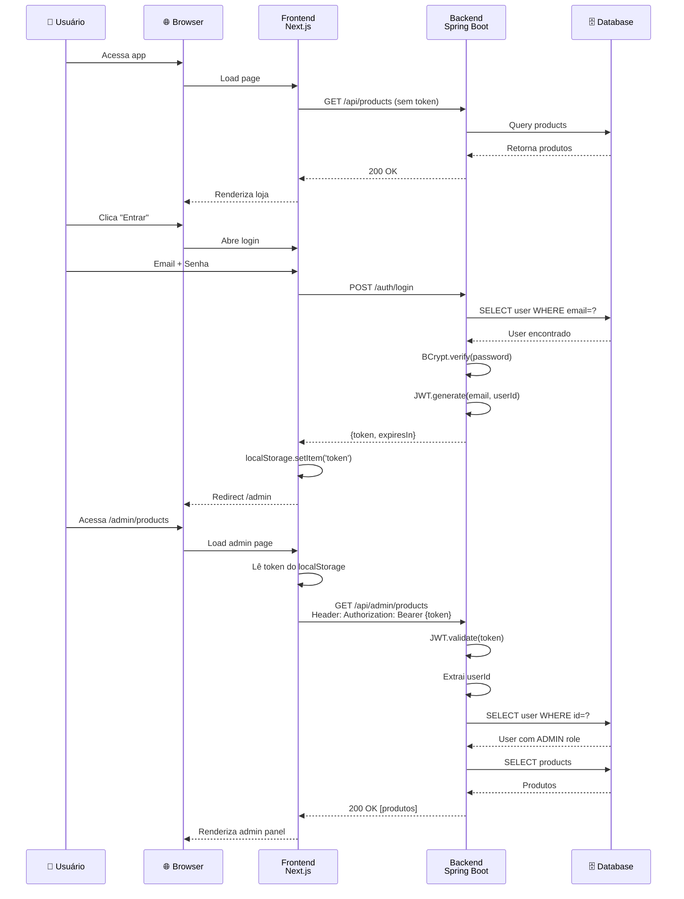
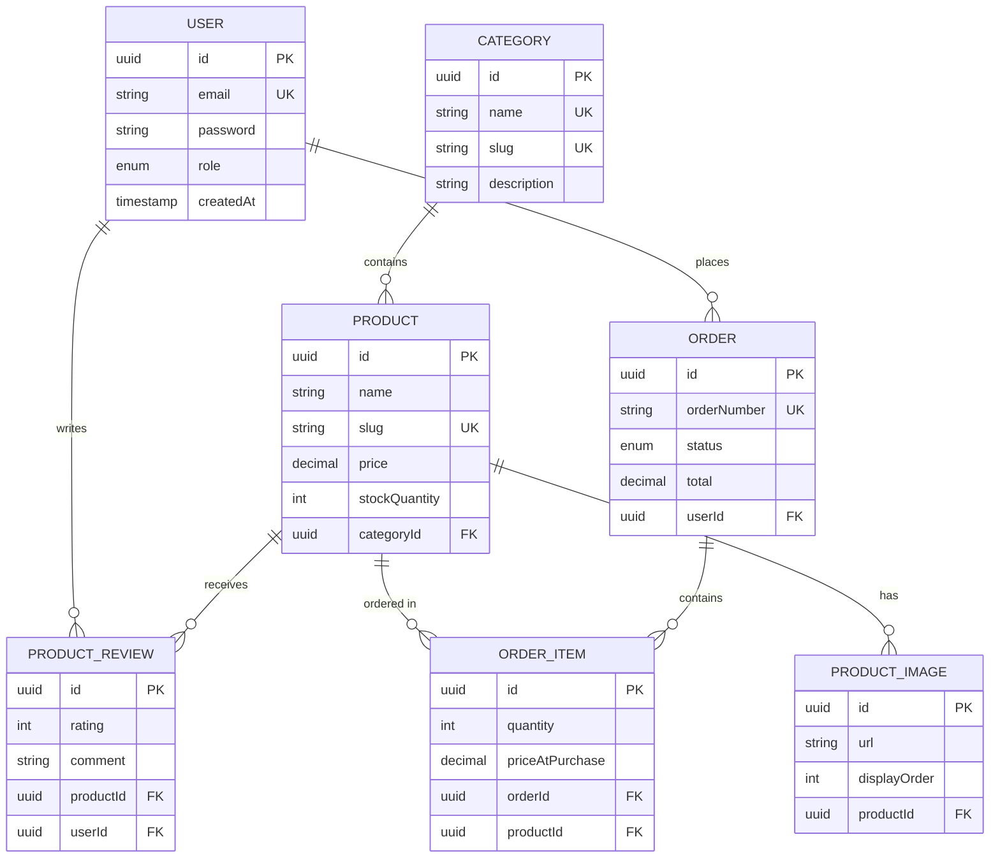
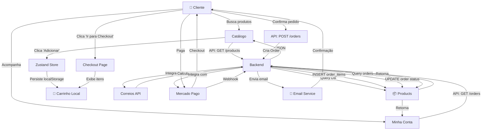
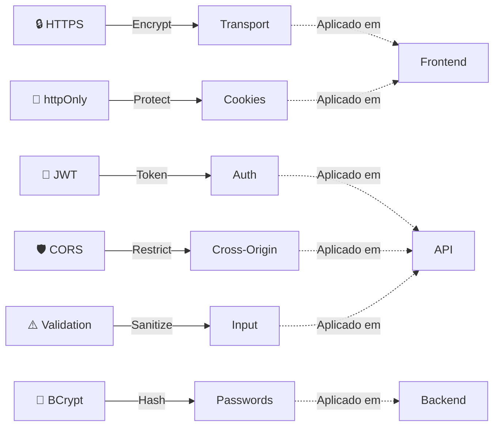
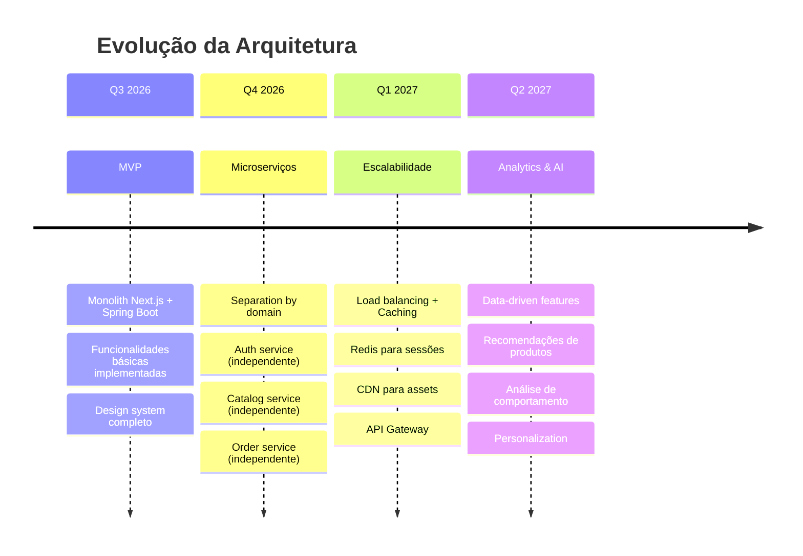

# 🏗️ Arquitetura do Sistema — Mais que Mimo E-commerce

## Diagrama: Fluxo de Requisições

---

## Diagrama: Estrutura de Módulos

---

## Diagrama: Flow de Autenticação

---

## Diagrama: Entidades e Relacionamentos

---

## Diagrama: Fluxo de Compra

---

## Detalhamento: Stack Technologies

### Frontend

| Camada | Tecnologia | Versão | Função |
|--------|-----------|--------|--------|
| Framework | Next.js | 15 | SSR, SSG, API Routes |
| Biblioteca UI | React | 19 | Components, Hooks |
| Linguagem | TypeScript | 5.x | Type Safety |
| Styling | TailwindCSS | 4.x | Utility-first CSS |
| Componentes | shadcn/ui | Latest | Radix UI + Tailwind |
| State (Local) | Zustand | Latest | Cart, UI state |
| State (Server) | React Query | 5.x | Data fetching, caching |
| Forms | React Hook Form | Latest | Form management |
| Validação | Zod | Latest | Schema validation |
| HTTP Client | Axios | Latest | API requests |
| Temas | next-themes | Latest | Dark mode |
| Icons | Lucide React | Latest | Icon components |
| Date | date-fns | Latest | Date formatting |

### Backend

| Camada | Tecnologia | Versão | Função |
|--------|-----------|--------|--------|
| Framework | Spring Boot | 3.4 | Web framework |
| Linguagem | Java | 21 | Backend language |
| ORM | Hibernate/JPA | 6.x | Database mapping |
| Security | Spring Security | 6.x | Authentication |
| JWT | JJWT | 0.12.3 | Token management |
| Password | BCrypt | Latest | Password hashing |
| DB | PostgreSQL | 16 | Relational DB |
| Migrations | Flyway | Latest | Schema versioning |
| Build | Maven | 3.9 | Dependency management |
| Logging | SLF4J | Latest | Logging framework |
| Utils | Lombok | Latest | Boilerplate reduction |
| Validation | Jakarta | 3.x | Bean validation |

### Infraestrutura

| Componente | Tecnologia | Versão | Função |
|-----------|-----------|--------|--------|
| Containerização | Docker | Latest | Containerize apps |
| Orchestração | Docker Compose | Latest | Multi-container |
| CI/CD | GitHub Actions | N/A | Automated testing |
| VCS | Git | N/A | Version control |
| IDE | VS Code | Latest | Development |

---

## Padrões de Segurança

---

## Próximas Fases de Arquitetura

---

**Última atualização**: 29 de junho de 2026  
**Status**: Foundation Complete ✅
